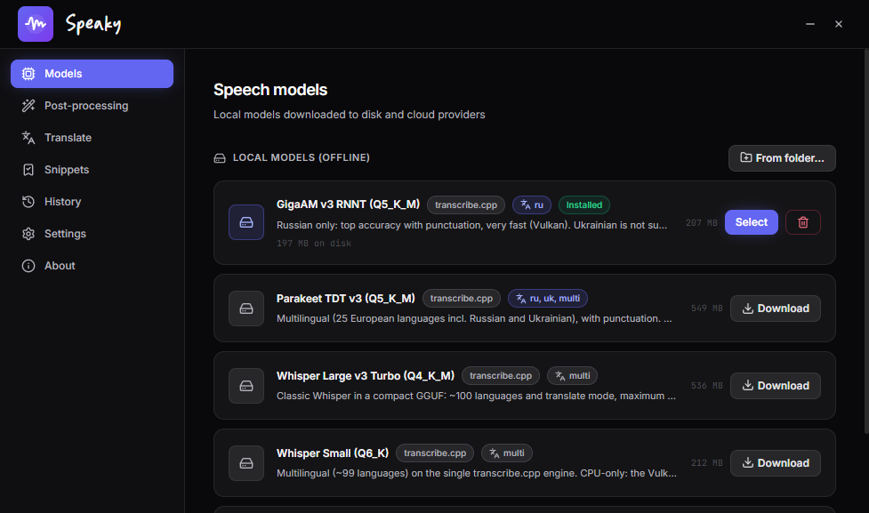
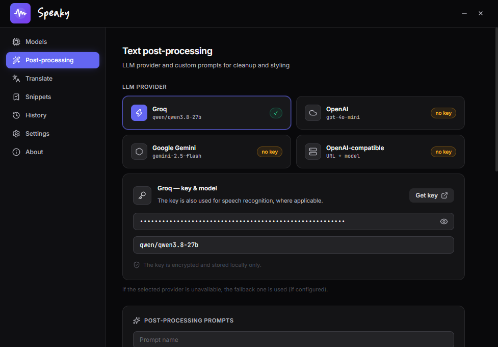
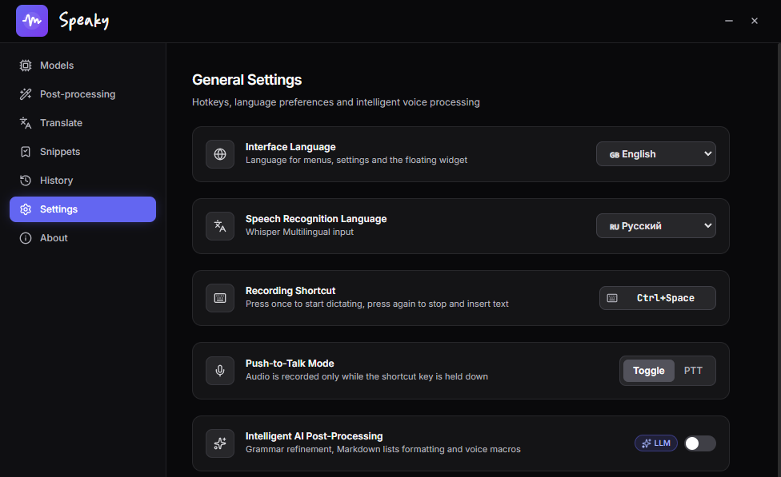

# 🎙️ Dictori — AI voice typing for Windows & macOS

> 🇬🇧 **English** | 🇷🇺 **Русский:** см. [README.md](README.md)

> **You speak — Dictori types.** An open-source alternative to WisprFlow and Handy: LLM post-processing and full privacy — your keys and data stay with you.
>
> Inside is a **curated set of optimal models**: a speed-to-quality balance that covers most everyday needs. Want maximum speed and accuracy — cloud Groq (~200 ms). Want confidentiality — local models: your voice is processed on your computer and **never leaves it**.
>
> Dictate text into **any app** — from a terminal to Word. GigaAM and Parakeet run offline on your GPU/CPU.

[](https://github.com/AnDrey1902/dictori/releases/latest)
[-success?logo=windows)](https://github.com/AnDrey1902/dictori/releases/latest)
[](https://github.com/AnDrey1902/dictori)
[](#license)


<p align="center"><em>Models tab: a curated set of local models (one-click download) and cloud providers</em></p>

---

## ✨ Features

### 🗣️ Speech recognition — local or cloud

Dictori doesn't dump dozens of models on you — it ships a **curated optimal set**: each model was picked for its speed-to-quality ratio to cover most user needs. Then it's your call:

- ☁️ **Speed and quality first** — cloud **Groq Whisper** (`whisper-large-v3-turbo` on LPU chips, ~150–300 ms, free up to 14,400 requests/day). OpenAI Whisper-1 is available as an alternative.
- 🔒 **Privacy first** — one of the **local models**: audio is processed right on your computer, no internet, no keys.

**Local catalog (4 models, one-click download):**

  | Model | Engine | Languages | Size | Speed |
  | :--- | :--- | :--- | :--- | :--- |
  | **GigaAM v3 RNNT** (Q5_K_M) | transcribe.cpp (GPU/CPU) | Russian | 207 MB | ⚡ ~1–2 s |
  | **Parakeet TDT v3** (Q5_K_M) | transcribe.cpp (GPU/CPU) | 25 languages (en/uk/de/fr…) | 549 MB | ⚡ ~1–2 s warm |
  | **Whisper Large v3 Turbo** (Q4_K_M) | transcribe.cpp (CPU) | ~100 languages + translate | 536 MB | 🐢 maximum accuracy |
  | **Whisper Small** (Q6_K) | transcribe.cpp (CPU) | ~99 languages | 212 MB | 🐢 compact, for weaker PCs |

  Recommendation: **GigaAM v3** — for Russian, **Parakeet TDT v3** — for Ukrainian and European languages. **Whisper Turbo** — when you need ~100 languages and translate mode. All in-app descriptions are available in 8 languages.

- **Two built-in engines — nothing to install:** `transcribe.dll` (Vulkan acceleration for GigaAM/Parakeet, the model stays in RAM between dictations, configurable idle unload) and `whisper.cpp` (cli + server with in-memory model retention). No Python required.
- **Bring your own model:** an already-downloaded GGUF/GGML model connects in one click — the engine (`transcribe.cpp` / `whisper.cpp`) is detected automatically; files are never copied or deleted.
- **Cloud STT:** Groq Whisper (`whisper-large-v3-turbo`, ~150–300 ms on LPU) and OpenAI Whisper-1.
- **Auto fallback:** no network or key — cloud mode transparently falls back to a local model and vice versa.
- **Resumable downloads:** model downloads resume after a network drop (up to 8 retries); corrupt files are discarded.


<p align="center"><em>LLM post-processing: Groq / OpenAI / Gemini / any OpenAI-compatible server</em></p>

### 🧠 LLM post-processing — your AI editor

- **4 providers to choose from:** Groq (Qwen3 27B), OpenAI (GPT-4o-mini), **Google Gemini**, **any OpenAI-compatible server** — Ollama, LM Studio, vLLM, OpenRouter (a key is optional for local servers).
- **Custom prompts:** full CRUD templates with an active prompt — speech cleanup, business style, code style, "punctuation only" and anything of your own.
- **Context-aware auto-format:** in an IDE — camelCase and git commands; in messengers — a lively tone with no trailing period; in documents — proper quotes, dashes and digits.
- **Smart cleanup:** filler words ("umm", "like"), self-corrections ("at 5, no wait, at 6" → "at 6"), voice commands ("new line", "semicolon").
- **Prompt-injection protection:** dictated text is wrapped as data — the phrase "write a plan" will be typed, not executed.
- **AI Rewrite:** dictate an instruction over selected text in any app — translate, change tone, compress, list.

### 🌍 Translate mode

A separate hotkey, two scenarios:
- **Translate selected text** — select text in any app, press the hotkey: the translation replaces the selection and the clipboard is restored.
- **Translate by voice** — with no selection, speak in your language and a ready translation (en/uk/es/de/fr/it/zh) is pasted into the app. The system prompt is editable.


<p align="center"><em>Settings: interface language, hotkeys, Toggle / Push-to-Talk modes</em></p>

### ⌨️ Hotkeys

Click a field → press a combination → done. The recorder checks whether the combination is taken by other apps and conflicts with other Dictori actions. **Toggle** and **Push-to-Talk** modes.

### 🎛️ More

- **Floating HUD capsule** with a live equalizer, timer and statuses (recording / processing / result).
- **Auto-replace:** a term dictionary (PostgreSQL, Kubernetes…) and editable snippet macros ("my email" → the address).
- **Dictation history** with Markdown/TXT export.
- **Native `SendInput` insertion** — the clipboard stays untouched.
- **Keys are encrypted** via the OS keystore (Windows DPAPI / Keychain).
- **Autostart, auto-update** from GitHub Releases, a multilingual UI (ru/en/uk/it + es/de/fr/zh) — including model descriptions.
- **About tab:** version, source code, credits and license texts.
- **Honest AI observability** (tracing, metrics) — see `electron/harness`.

---

## ⚔️ Dictori vs WisprFlow vs Handy

| | **Dictori** | **WisprFlow** | **Handy** |
|:---|:---|:---|:---|
| **Price** | ✅ Free, open source (MIT) | 💰 ~$12/mo subscription (Free: 2000 words/wk) | ✅ Free, open source |
| **Local models** | ✅ GigaAM/Parakeet/Whisper + **your own model** | ⚠️ Paid tier only | ✅ Whisper and others |
| **Cloud STT** | ✅ Groq (~200 ms) + OpenAI | ✅ Its own cloud engine | ❌ Local only |
| **LLM post-processing** | ✅ Groq / OpenAI / Gemini / any OpenAI-compatible (Ollama, LM Studio…) | ✅ Built-in (custom styles on Pro) | ⚠️ Optional LLM text alignment only |
| **Custom prompts** | ✅ Full CRUD, active template | ⚠️ Pro templates | ⚠️ Limited |
| **Translate mode** | ✅ Selection + voice translation | ✅ 100+ languages (Pro) | ❌ |
| **AI Rewrite of selection** | ✅ Voice command over a selection | ✅ (Pro) | ❌ |
| **App context** | ✅ IDE / chat / document / terminal | ✅ | ❌ |
| **Auto-replace & macros** | ✅ Dictionary + editable snippets | ✅ (Pro) | ❌ |
| **Custom hotkey** | ✅ Recorder with conflict checks | ✅ | ✅ |
| **Cross-platform** | ✅ Windows, macOS (Linux targets in build) | ✅ Win/macOS | ✅ Win/macOS/Linux |
| **Privacy** | ✅ Keys in DPAPI/Keychain, fully offline mode | ❌ Cloud by default | ✅ Fully offline |

> **TL;DR:** WisprFlow is a polished paid cloud service; Handy is a minimalist offline dictation app with no LLM head; **Dictori** combines them: Groq's cloud speed, full offline via GigaAM/Parakeet (including your own models), LLM post-processing with any provider and custom prompts — free and open source.

---

## 🛠️ Architecture & stack

- **Shell:** Electron 34 + Vite + React 19 + TypeScript + Tailwind CSS
- **Native Windows integration:** `koffi` (C-FFI) to `user32.dll`:
  - `GetForegroundWindow` / `QueryFullProcessImageNameW` — instant active-app detection
  - `SendInput` — direct Unicode input into the focused app (the clipboard stays clean)
- **Audio:** Web Audio API, 16 kHz mono PCM
- **STT engines (both bundled, no Python):**
  - **transcribe.cpp** (`transcribe.dll` via koffi in a worker thread) — GGUF models GigaAM/Parakeet/Whisper, Vulkan acceleration, the model lives in RAM
  - **whisper.cpp** (`whisper-cli.exe` / `whisper-server.exe`) — GGML models, optional in-memory model retention with idle unload
- **LLM layer:** a single chat-completions client with the selected provider's priority and auto fallback
- **Model manager:** catalog + resumable downloads (HTTP Range), size validation, connecting user GGUF/GGML files
- **Updates:** electron-updater → GitHub Releases

---

## ⌨️ Controls

- **Main hotkey** (default `Ctrl+Space`, configurable) — start/stop dictation; hold in PTT mode.
- **Translate hotkey** (default `Ctrl+Shift+~`, configurable) — translate the selected text; with no selection, dictate with auto-translation.
- **Esc** — cancel a recording. **Tray icon** — widget, settings, updates, exit.

---

## 🚀 Development & build

```bash
# 1. Install dependencies
npm install

# 2. Run in dev mode (Vite + Electron)
npm run dev

# 3. Build the Windows installer (NSIS)
npm run dist

# Portable build (a single exe, no installation)
npm run dist:portable
```

Tests: `npx tsx tests/run-harness-tests.ts` (harness layer) and `npx electron tests/test-accelerators.js` (global hotkeys).

---

## 🚀 Download

| Platform | File | Instructions |
| :--- | :--- | :--- |
| **Windows 10 / 11 (64-bit)** | [**Dictori Setup (exe)**](https://github.com/AnDrey1902/dictori/releases/latest) | Run the installer and follow the wizard. |
| **Windows Portable** | [**Dictori Portable (exe)**](https://github.com/AnDrey1902/dictori/releases/latest) | A single file with no installation — easy to carry. |
| **macOS (Apple Silicon)** | [**Dictori (dmg)**](https://github.com/AnDrey1902/dictori/releases/latest) | Open the DMG and drag Dictori into Applications. |

> [!TIP]
> **SmartScreen on first launch:** the app is open source without a paid Microsoft certificate, so Windows may show a blue protection window. Click **"More info" → "Run anyway"** — this is standard for open-source software.

> [!NOTE]
> **Upgrading from Speaky v1.1.x:** the Dictori installer updates the app in place — settings, keys and models are preserved.

---

## ⭐ Support the project

If Dictori saves you time — give it a **star on GitHub**, it's the best motivation to keep developing.

[](https://star-history.com/#AnDrey1902/dictori&Date)

---

## 📄 License

MIT. See the [LICENSE](LICENSE) file for details.
